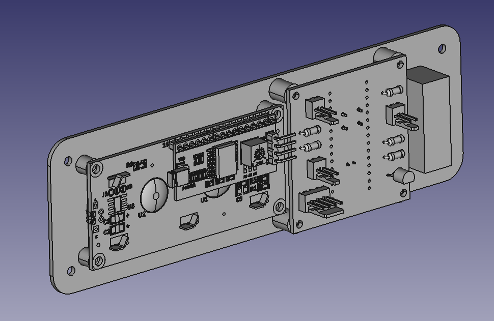
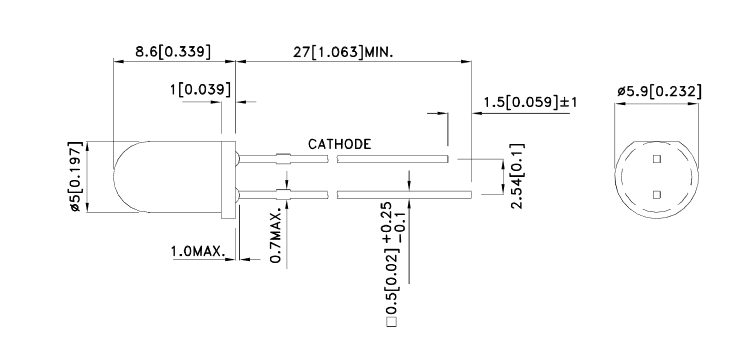
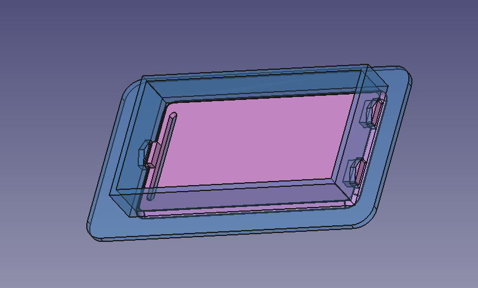
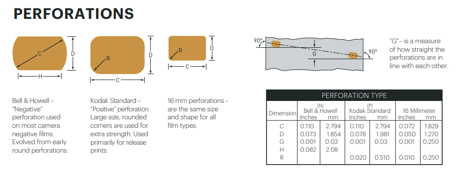
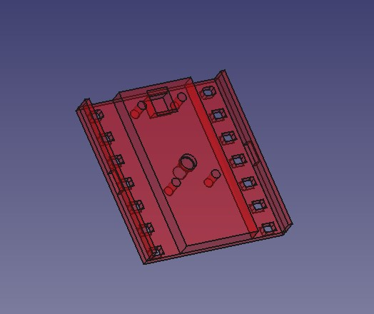
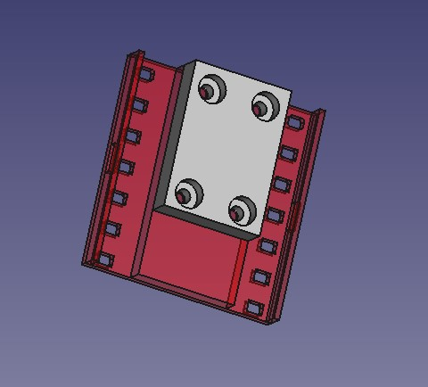
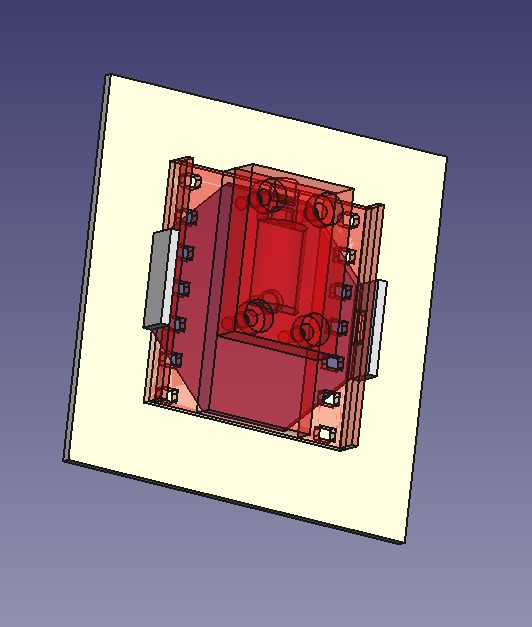

# Summary

- [Summary](#summary)
- [Casing Stories](#casing-stories)
  - [1. Design of the case, front side](#1-design-of-the-case-front-side)
    - [Description](#description)
    - [Realisation](#realisation)
    - [Screw holes](#screw-holes)
    - [Result](#result)
  - [2. Light source housing](#2-light-source-housing)
    - [Description](#description-1)
    - [Realisation](#realisation-1)
  - [3. Battery door](#3-battery-door)
    - [Description](#description-2)
    - [Realisation](#realisation-2)
    - [Conclusion](#conclusion)
  - [4. Prevent the sensor wire to rip](#4-prevent-the-sensor-wire-to-rip)
    - [Description](#description-3)
    - [Realisation](#realisation-3)
  - [5. LightSensorSupport](#5-lightsensorsupport)
    - [Description](#description-4)
    - [Result](#result-1)
  - [6. Medium format Adapter](#6-medium-format-adapter)
    - [Description](#description-5)
    - [Result](#result-2)

# Casing Stories

## 1. Design of the case, front side

### Description
Because designing the case may be a very complex activity, we will split in 3 steps :
* The design of the front panel
* The design of the case sides
* The design of the rear panel

Of course, the integration of these 3 parts has to be addressed

### Realisation
We use an open source model for LCD1602 : https://grabcad.com/library/1602-lcd-display-1

The Front panel need to put in place the main board, the LCD board, and te power switch. the thickness will be set to 1.5mm.

### Screw holes
One of the tricky thing is to choose the good screw hole diameter. It must be bigger than the core part of the screw, and smaller than the exernal diameter of the screw.
I have ordered iron plate screws, because they are most common than screxs for plastic.
However, screws for platics could have been ordered here :
https://www.visseriefixations.fr/eco-syn-pour-thermoplastiques-tcb-pozi-2-2x5-z-blanc.html  
We will order more specific screws when we'll have used all the screws we have ordered, described in the part list.
- Small screws : M2.2 x 6.5 mm
  - Core diameter : 1.9 mm
  - External diameter : 2.2 mm
- bigger screws : M2.9 x 13 mm
  - Core diameter : 2.2 mm
  - External diameter : 2.8 mm

Conclusion : we will use
  - 2 mm diameter for small screw holes (screws for pcb)
  - 2.5 mm diameter for bigger screw holes (screws for panels)

### Result 

Here is the front view :  
  

And here is the back :  

## 2. Light source housing

### Description

The case must take into account the size of the different elements, but also the need to hold the light source.
Decision is taken to hold the light source in the side of the case. This will make more simple the general handling of the tool. It than just has to be placed in front of the camera, and the light sensor in the back.
The goal is now to make a design in order to hold the light source LED in the wall of the case.  
The dimensional specifications of the light source LED are the following :  

### Realisation

We will test that :

A first test shows that the concept is not bad. However, it needs a lot of sanding in order to be able to insert the LED into the hole. So, the tolerences have to be increased to make easier the insertion of the LED. Furthermore, chamfers have been added to the hold piece.

## 3. Battery door

### Description

The idea is to create a door that can be opened by hand but that cannot open by itself.  
In one word, we wan to design a battery door.
The prefered design would need no screw.  

### Realisation

We use a well known design, that use a door with a slot at one side, that allows to unlock it by bending the side.  

Here is the inside view :

There is chamfers in the opposite direction on the door panel and on the outside panel, so they fit perfectly together. 
Howver, du to the 3D printing flaws, some tolerances have to be applied :  
The door panel has to be smaller of :
- the panel opening is 60x30 mm
- the door is 62 x 32
- The thickness of both panels is 1.5 mm
- the chamfers of both panels is 1.3 mm

The theretical overlap of each side is :  
thickness - 2 (thickness - chamfer)  = 2 chamfer - thickness. 
In our case it is : 2x1.3 - 1.5 = 1.1 mm
So, a perfectly build construction would have fit with a door having 62.2 mm x 32.2 mm.  
We use a little bit smaller dimensions to take into account the 3D printing flaws.

### Conclusion
In order to fit perfectly, with a panel thickness of 1.5mm and a 1.3mm chamfer on both panel and door, the **door** must be **2mm longuer** and **2 mm larger** than the panel opening.

## 4. Prevent the sensor wire to rip

### Description
The light sensor will be placed at the back of the camera in a separate casing, and linked to the main body using a wire. The wire will be connected to the main board using a dedicated connector.  
The point to adress in this story is the way the wire passes through the casing. The problem to solve is to prevent to accidentaly rip the connecter by pulling on the wire. There is two ways to address this :  
- Using another connector to pass through the case panel
- blocking the wire, using for instance chicanes, inside the casing

### Realisation

- [ ] **TODO**

## 5. LightSensorSupport

### Description  
The vision of the design of the LightSensor support is to have a core support, designed for the 35mm film format.  
To this, may be added adaptors to 120 film format : 645, 6x6, 6x9

Specifications of 35mm film can be read there :  
[Kodak film specification](https://www.kodak.com/content/products-brochures/Film/How-to-read-a-Kodak-film-can-label.pdf)

The 35mm film is 35mm large, 
Perforations pitch is 4.75mm.
Each perforation is about 2.8mm x 2.0mm large (KS perforation), at about 2 mm from the side of the film.  
Their corners are rounded, with 0.5mm radius.

Here are the physical specifications of the phototransistor :

A hole must be provided in the middle of the support to hold this phototransistor.

### Result
Here is the result :  
  
Holes have been provisioned at the sides of the support to allow to fit an adapter for medium format film cameras.

And, with the lessons learned from step 4, we also add a cover that prevent the wire to move.

## 6. Medium format Adapter

### Description
We need an adapter in order to be able to use the sensor also with medium format cameras.  
Medium format films are rolls of approximatively 6 cm large. This format is named "120 format".  
The cameras that use 120 film may have different exposed sizes : 6x4.5, 6x6, 6x7, 6x9, ...
We will design a 6x6 adapter. Other format will be easily adapted from that.

### Result
And here is the result :
  
This is a very simple but efficient design.  
The adapter can be easily fit on or off by bending it.

