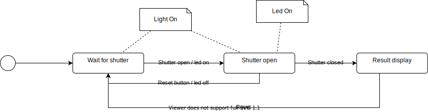
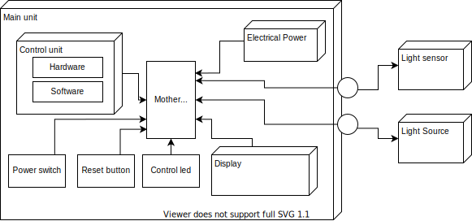

# shutter_speed_tester

A project that goal is to design and build a tool that allows to test the shutter speed accuracy of a film camera

## Introduction

When people passionated of old film cameras want to use their camera to shoot film, this sometimes result in an over or an under exposed film.  
This is usualy due to the speed of the camera shutter that is not any more accurate. In order to check the shutter speed accuracy, the camera owner have to compare the actual opening time of the shutter with the expected one.  
This is the purpose of the shutter speed tester : measure the accuracy of shutter speed. 

## Principle

## Usage

1. Put the enlighting light in front of the camera
2. Put the light sensor at the open back of the camera
3. Switch the device on
4. Press the camera shutter button
5. Read the measured camera speed (displayed as a time (t) and as a speed (1/t)), and compare it to the setting of the camera (1/60, 1/125, etc)
6. To perform the measure again, maybe with another camera setting, press the Reset button on the device, and go to 4.

## State Diagram

## Project scope

The project scope is to describe how to build a shutter speed tester tool.
The outputs of the project are :
- design documents, including the design process itself
- build description

## Preliminary design

The system is very small and is not interfaced with other systems, except
- The user
- The camera

Thus we will not write a complete system analysis of this. We will jump directly to the physical architecture design of our tool :

|Component role | Component choice | Comment |
|---------------|------------------|---------|
| Main unit     | Compound         | The main unit is composed of several other components.  A specific casing has to be be designed for it |
| Control unit (hardware) | Arduino Nano | An arduino nano microcontroler would fullfill all the needs :  - low price - low dimensions - low electric cosumption  - capacity to interact with simple electronic components |
| **Control unit (software)**| Specific code| This will be one of the subjects of this project. It has to make the link between the differents componetns of the tool |
| Electrical power | Battery | The detailed design of the battery part has to be defined later.  The use of battery allow a more practical usage of the tool.  The low consumption of the arduino allow to use it without a to high battery consuption |
| Power switch | Flip flop switch | A "hard" power switch will be preferred rather than a standby push button, in orther to not use the battery at all when not in use |
| Reset button | Push button | The Reset button will be able to erase the previous result and start a new measure |
| Control led| Led | the control led will help the operator to see that the light sensor is currently detecting light (when the shutter is open, if the light source and the light sensor are correctly positionned)|
|Display| 2x16 LCD| A 2x16 LCD is very common, low price and easy to control with an Arduino|
|Light source| Led| The light source has to be chosen in accordance with the light sensor sensitivity (intensity and even maybe wavelength). It has to be mounted preferably on a physical support that allows to adjust the position according the tested camera. There is two options for the light source :    1. Use an independent light source, maybe even don't include it in the package and let the user choose it by himself   2. Use a light source powered by the tool The option 2 is prefered because it allow to have a real control on the quality of the light source. Indeed much of commercial led lamps are quickly blinking when used in eco mode and cannot be used for our purpose. The challenge is to have a light source that    - is bright enough to allow the light sensor to detect the opening of the shutter   - does not use too much electrical power and does not drain the battery too fast|
| Light Sensor | Phototransistor | A phototransistor is a good compromise between a low price, a good sensitivity and a low reaction time.  A specific support has to be designed, maybe according different film formats, in order allow a good position on the camera back, in order to easily detect the source light and not be influenced by environment light |

## General design process

The design process will be split in multiple steps. The idea is to first derisk all that may be tricky.  
At first the electrical circuits design and software components will be tested using a solderless breadboard.  
When all work well, a dedicated motherboard will be designed and manufactured.  
A dedicated casing and mecanical support will be draw and 3D printed.

## Design & development tools

The design & development tools are the following
| Tool name      | Version  | Purpose     | link                            |
| -------------- | -- | ----------- | ------------------------------- |
| Fritzing      | 0.9.3 | Electronic component & circuit design       | https://fritzing.org/ |
| KiCad | 5.1.12 | Electronic component & circuit design| https://www.kicad.org/ |
| FreeCad | 0.19.2 | 3D modeling | https://www.freecadweb.org/ |
| Arduino IDE   | 1.8.16 |Arduino cross development IDE    | https://www.arduino.cc/en/software |
| VSCode | 1.62.0 | General purpose code editor | https://code.visualstudio.com/ |
| Drawio integration | 1.6.201 | Integration of Drawio tool into VSCode IDE |

## Developpement steps description

[Development steps](DevelopmentStories.md)

## Part list
| Name | Description | Aprox. Price | Reference |
| ----- | -------------| ---------- | ------ |
| High power Led | A 8000 mcd red led | 0.62 € | 1050453 - LED 5 mm L-7113SEC-J3 https://www.conrad.fr/p/kingbright-l-7113sec-j3-led-rouge-rond-5-mm-8000-mcd-20-20-ma-22-v-1050453 |
| Green LED | | 0.17 € | 180180 - LED 5 MM SUPER LUMIN TYPE L-7113CGDK https://www.conrad.fr/p/kingbright-l-7113cgdk-led-vert-rond-5-mm-140-mcd-30-20-ma-21-v-180180|
| Push button | | 0.23 €| 705338 - INTERRUPTEUR LOW COST JTP-1230L https://www.conrad.fr/p/namae-electronics-jtp-1130l-bouton-poussoir-a-pression-12-vdc-005-a-1-x-offon-a-rappel-1-pcs-705338 |
| Toggle switch | Used as power switch | 1.53 € | 1587528 - Inter à bascule TC-R13-70A-01 https://www.conrad.fr/p/interrupteur-a-bascule-tru-components-tc-r13-70a-01-1587528-24-vdc-10-a-1-x-offon-a-accrochage-1-pcs-1587528 | 
| JST XH connector or   molex 6410 / KF2510 connector |  molex 6410 are finally used  |   |   |
| Arduino nano | | 13 € | https://www.conrad.fr/p/tru-components-carte-de-developpement-atmega328-nano-development-board-2134126 |
| Resistors | | | |
| LCD 1602 I2C | | 9.49 € | https://www.conrad.fr/p/display-elektronik-ecran-lcd-l-x-h-x-p-80-x-36-x-66-mm-2238769|
| I2C Interface for LCD || 4.50 € | https://www.conrad.fr/p/iduino-me033-1-pcs-2315239 |
| Phototransistor | | 0.90 €| 153870 - PHOTOTRANS. SFH309-5/6/CT1 https://www.conrad.fr/p/osram-phototransistor-3-mm-1080-nm-12-sfh-309-153870|
| Transistor 2N2222| NPN Transistor | 0.10 € | 1265001 - Transistor bipolaire PN2222ATA https://www.conrad.fr/p/on-semiconductor-transistor-bjt-discret-pn2222ata-to-92-3-1-npn-1265001|
| Jack audio mono 3.5mm female socket | | 0.88 € | https://www.conrad.fr/p/jack-35-mm-embase-femelle-verticale-tru-components-718672-nombre-de-poles-num-2-mono-noir-1-pcs-1567107 |
| Jack audio male male connector | | 1.60 € | https://www.conrad.fr/p/tru-components-93038c440-cable-de-connexion-jack-jack-male-35-mm-extremites-ouvertes-mono-1-pcs-1662323 |
| Wire || 0.54 €| 457844 - Câble audio NF1106005 https://www.conrad.fr/p/bkl-electronic-1106005-cable-audio-1-x-010-mm-noir-marchandise-vendue-au-metre-457844|
| 9V battery connector | | 0.55 € | https://www.conrad.fr/p/connecteur-clip-pression-1x-6lr61-9-v-beltrona-9v-t-clip-raccordement-par-empreinte-pile-9v-l-x-l-x-h-26-x-13-x-8-mm-490660 |
