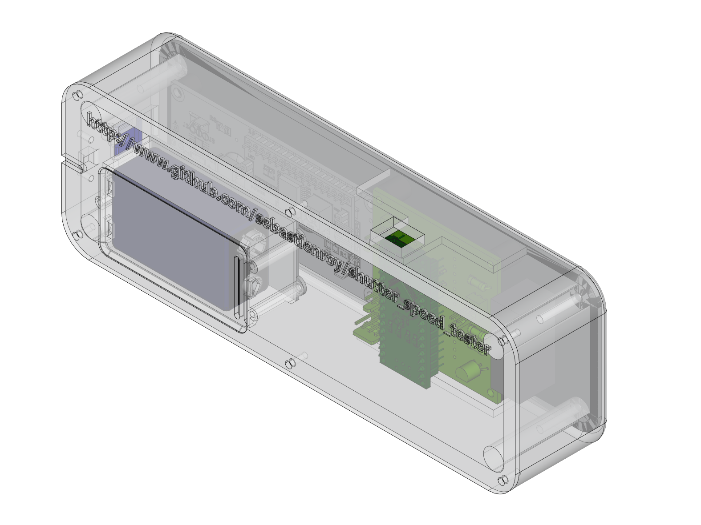
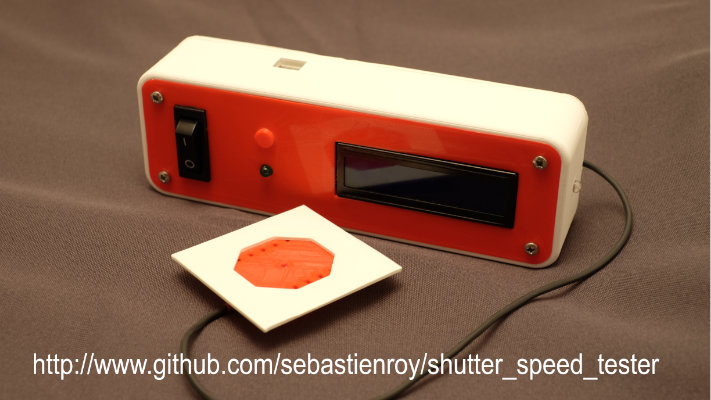
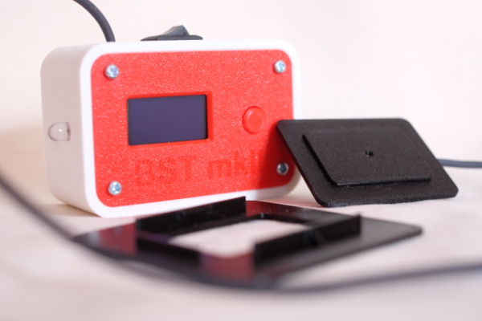
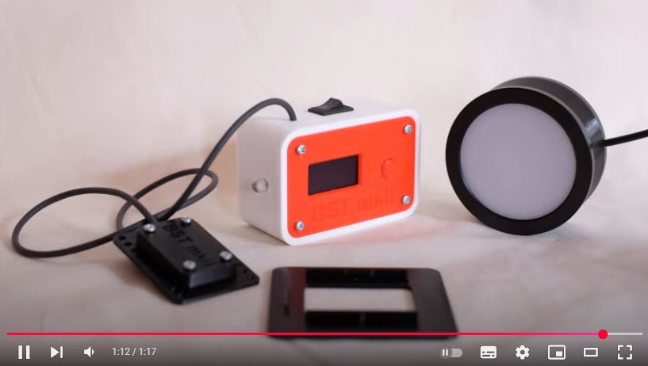
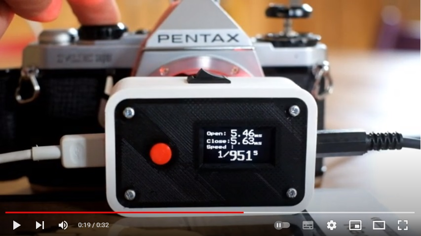

# Shutter Speed Tester for Film Cameras

The shutter speed tester is a project which goal is to design and build a tool that allows to test the shutter speed accuracy of a film camera

When people passionated with old film cameras want to use their camera to shoot film, this sometimes results in an over or an under exposed film.  
This is usually due to the speed of the camera shutter that is not any more accurate. In order to check the shutter speed accuracy, the camera owner has to compare the actual opening time of the shutter with the expected one.  
This is the purpose of the shutter speed tester : measure the accuracy of shutter speed. 

Here is a presentation video (in French) :  

The result of this open source project is to allow anyone who has the minimum skills in DIY domain to build his own device

[Here is the description of the open source project.](project_description.md)

## Accuracy of the open source tester

The resulting tester has been tested against two methods described in [shutter meta tester project](https://github.com/sebastienroy/shutter_meta_tester) : time slot method and rotating wheel method.  
With the time slot method (an LED lit during a given time duration), the difference between expected and measured value is about a few tens of microseconds. This error is due mainly to the latency of the phototransistor. This error is small enough to not to be taken into account even at speed up to 1/2000s.  
With the rotating wheel method, we can observe an error a lot bigger. This error is not due to electronic factors, but results from geometric facts:  
The sensor of the tester is a bulb of 3mm diameter.  
At 1/1000s, given that the curtains translation speed is about 3m/s, the slit width of the curtain shutters is about 3mm large.  
When trying to measure a 3mm object with a 3mm sensor, the resulting error is about 100%.  
**So, because of geometric consideration, the use of such a tester should be reserved for speeds not exceeding 1/250.  
The conclusion is the same for all testers with a similar sensor that do not provide a calibration mechanism.**  

# Baby Shutter Tester mark II
Many people, interested to get such a device but who don't feel skilled enough to build their own copy, asked the author of the project to build it for them.  
This resulted to the commercial version of the tool, the Baby Shutter Tester (mark I).  
The Baby Shutter Tester was regularly improved, and its main additional feature was the ability to self calibrate.  **The self-calibration mechanism allowed a precision of a few microseconds, instead of 1 stop at high speeds.**  
However, the precision brought by the self-calibration procedure required to follow a very specific process, difficult to implement outside a workshop.  

So, a completely reworked version has been designed: the **Baby Shutter Tester Mark II.**  
The speed measurement method impleted by this new version is completely different: instead of starting a timer at a given light illumination threshold, the tester takes into account all the light variations that hits its sensor.  
This allows to take into account high speed ranges, where the shutter cannot be considered as a perfect shutter, i.e. the cases where the shutter cannot be aproximated to an on/off mechanism.  
This method is similar to the method used by the Kyoritsu legacy professional shutter tester.  
In addition, the Baby Shutter Tester Marks II meets all the recommendations of the ISO-516:2019 standard. Not only the testing method but also all the measurement precision requirement described by the standard.  

The benefits of this characteristics are the following:
- An extreme accuracy
- The accuracy is obtained without calibration procedure
- Using the optional light source with diffuser, the tester can also measure central (leaf) shutters without any bias.

## Video presentation
  

## Accuracy test methods
The accuracy of the Baby Shutter Tester mark II is checked using 
- the graphical verification method described in the ISO-516:2019 standard
- [a dedicated benchmark](https://github.com/sebastienroy/shutter_meta_tester).
 
## Where to buy 
[eBay link](https://www.ebay.fr/itm/205397044799)

## User manual

[User Manual](https://github.com/sebastienroy/shutter_speed_tester/wiki/Shutter-Testers-documentation)

# Curtain travel time measurement: The Shutter Lover

The Shutter Lover is a tool specialized in the measurement of the travel time of the curtains of focal plane shutters.  
The measurement of the curtain travel time is necessary for camera repairers, in order to be able to ajust the springs of each of the curtains.  
The goal is to obtain an homogeneous travel time of the two curtains, with values in accordance with the manufacturer recommendations.  
This product is available for [purchase on ebay](https://www.ebay.fr/itm/204344103169).  

Here is a short teaser :  

## User Manual  

[User Manual](https://github.com/sebastienroy/shutter_speed_tester/wiki/Shutter-Testers-documentation)

## Test bench

In order to get the better precision and reproducibility with the shutter Lover, it is recommended to use a test bench, such as the one describe [here](testbench/testbench.md).  
