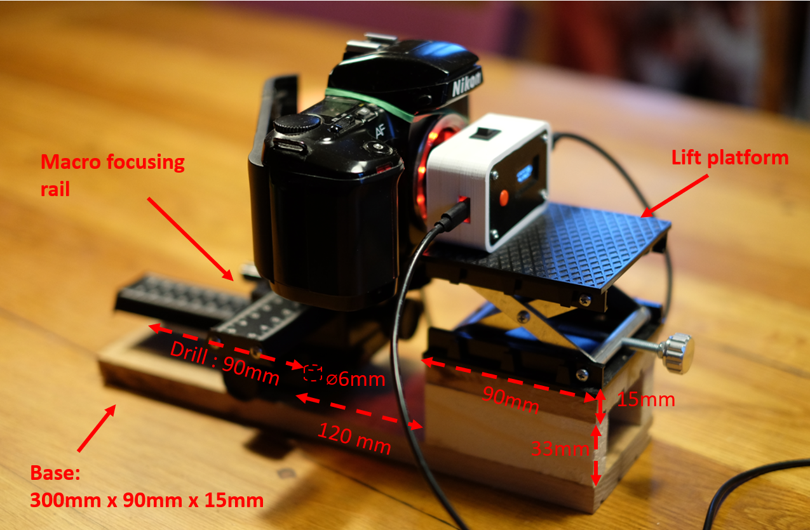

# Test Bench

In order to improve the reproducibility and the precision of the measure, it is recommended to use a test bench for measuring speeds above 1/250s.  

Here is a description of a suitable test bench

To build this bench you will need the following:
- A macro focusing rail (like [this one](https://aliexpress.com/item/1005001804948944.html) )  
- A lift platform (such as [this one](https://aliexpress.com/item/1005002895053253.html) )
- 2 1/4" Kodak camera screws (like [this](https://www.aliexpress.com/item/1005005803164258.html))
- Some pieces of 15mm thick wood
- Some wood screws
- A driller
- wood glue

_The dimensions above are those of the described bench. Of course it is not the only way to build a test bench._

The base of the bench is a board 30cm long and 9cm large.  
At one side, there is a kind of "bridge" that allows to raise the lift platform, and is high enough (33mm) to put on the rail to pass.  
The lift platform is screwed on the bridge.  
A 6mm hole is drilled into the base, that allows to screw the macro focusing rail on the base. 
A router has been used to thin the board around the hole and allow the screw to be housed inside.  

Depending if you use the bench for the Baby Shutter Tester or the Shutter Lover, you will have to flip the top rail (and/or the bottom rail) of the macro focusing rail in order to adapt to the measuring distance of the tool.

